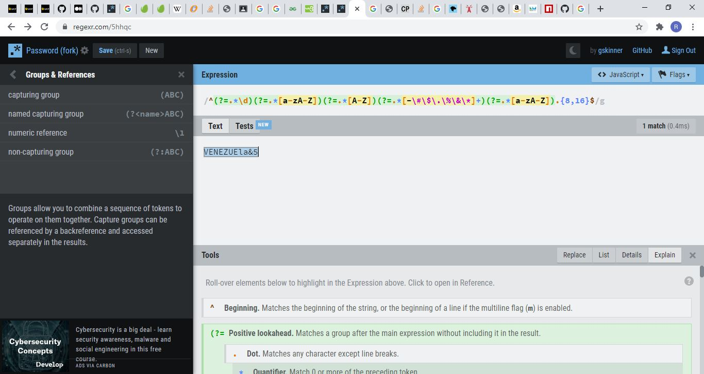

# passwordValidation
Regex to validate password

## Description 

A brief example to code a Password Validation in Javascript client-side using Regex.

## Table of Contents

* [URLs](#urls)
* [Installation](#installation)
* [Usage](#usage)
* [Contributing](#Contributing)
* [License](#license)
* [Test](#Test)
* [Questions](#questions)
* [Screenshots](#screenshots)

## URLs

* Deployed Application: 
    - [https://rogers0404.github.io/passwordValidation/](https://rogers0404.github.io/passwordValidation/) 

* GitHub Repository:
    - [HTTPS: https://github.com/rogers0404/passwordValidation.git](https://github.com/rogers0404/passwordValidation.git)    
    - [GIT: git@github.com:rogers0404/passwordValidation.git](git@github.com:rogers0404/passwordValidation.git)

## Installation

None

## Usage 

Try it in live:
[https://rogers0404.github.io/passwordValidation/](https://rogers0404.github.io/passwordValidation/)

## Contributing

* Rogers Ramirez, Github User: [rogers0404](http://github.com/rogers0404)

## License

passwordValidation App is licensed under the

None

## Test

None

## Questions

If you have any questions about the application, you can check the documentation on my GitHub profile [https://github.com/rogers0404](https://github.com/rogers0404).

for more information you can have a question via email [rogers.ramirez2008@gmail.com](rogers.ramirez2008@gmail.com)  .

## Screenshots

### Screenshot 1

